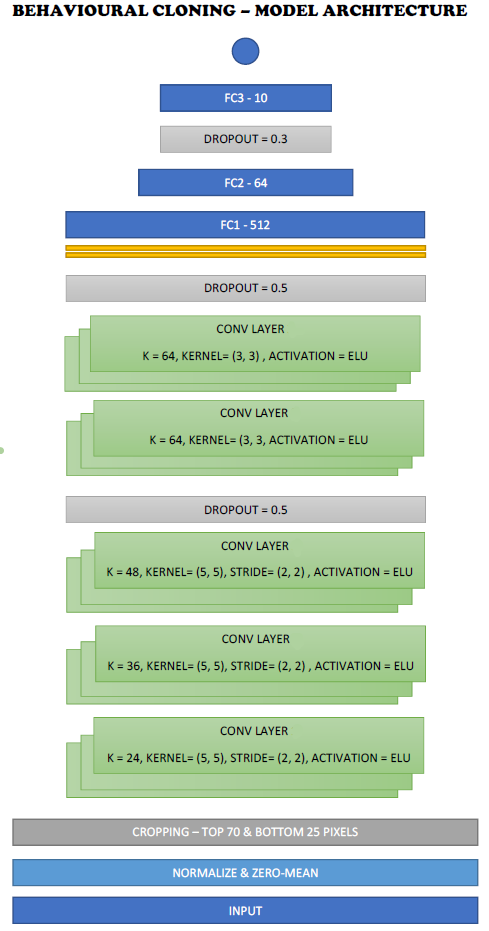
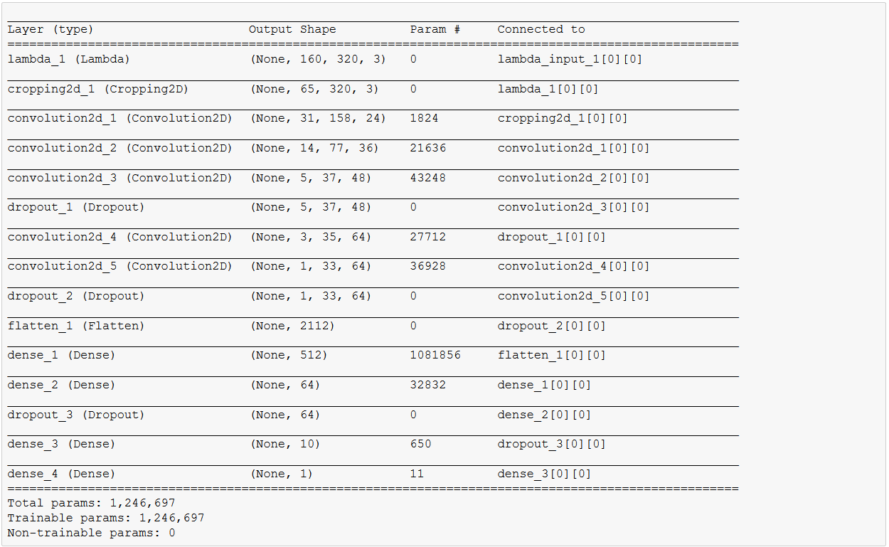
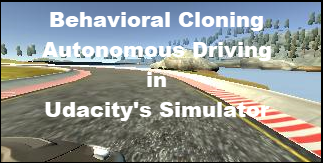

# Udacity Self-Driving Car Engineer Nanodegree


## Term 1 Project 3 : Behavioral Cloning
### Project Writeup

---

The goals / steps of this project are the following:
* Use the simulator to collect data of good driving behavior
* Build, a convolution neural network in Keras that predicts steering angles from images
* Train and validate the model with a training and validation set
* Test that the model successfully drives around track one without leaving the road
* Summarize the results with a written report
---
#### Rubric Points
Here I will consider the [rubric points](https://review.udacity.com/#!/rubrics/432/view) individually and describe how I addressed each point in my implementation

---
### Files Submitted & Code Quality

#### 1. Submission includes all required files and can be used to run the simulator in autonomous mode

My project includes the following files:

|File Name        |Purpose                                                                             |
|:----------------|------------------------------------------------------------------------------------|
|model.py         |Contains the script for the model, pre-processing and augmentation of data, training|
|drive.py         |Used for driving the car in autonomous mode using the model generated by model.py   | 
|model.h5         |Contains a trained convolution neural network                                       |
|video.mp4        |Autonomous run in the simulator for Track 1 based on the model generated by model.py|
|writeup_behavioral_cloning.md|Contains project writeup                                                            |   

#### 2. Submission includes functional code
Using the Udacity provided simulator and my drive.py file, the car can be driven autonomously around the track by executing 
```sh
python drive.py model.h5
```

#### 3. Submission code is usable and readable

The model.py file contains the code for training and saving the convolution neural network. The file shows the pipeline I used for training and validating the model, and it contains comments to explain how the code works.

---
### Model Architecture and Training Strategy

#### 1. Model Architecture
My model is based on the NVIDIA End-End Deep Learning for Autonomous Cars.
I've modified the architecture to fit to my use case and tuned it for better results.

A pictorial representation of the model can be seen below



I've built my model using Keras as it defines simple syntax for defining models so that I can concentrate more on pre-processing and augmenting the data.

Here's how my model is a good fit for this model

 **Input Layer** : It all starts with a 160 * 320 pixel Color Image fed to the network. The training data set is generated using the simulator training environment's video feed

 **Normalization Layer** : I've used Keras Lamdba layer to normalize the input. Normalizing and making the data zero-mean makes the model to train much faster as the gradient descent can be handled in a much better way for zero-mean numbers

 **Convolutional Layers** : Since we are dealing with images, the feautre classification is important to identify the corners and take decisions based on that. Convolutional layers help a lot for this problem.

 **Dropout Layers** : Overtraining the model could lead to over-fitting and this can be avoided by randomly dropping certain weights using dropout layers. This will help the model to train in such a way that it is not dependent on any set of parameters as the parameters can become zero anytime - thus decoupling the hyperparameters from the results

 **Fully Connected Layers** : The problem of identifying the steering angle is a regression problem and Fully Connected layers help in achieving the right angle based on the training model

 **Activations** : The model should be non-linear and in order to achieve that, ELU functions have been used for activating the neurons
 
 **Optimizer** : Adam (Adaptive Moment Estimation) Optimization is used during training. This is an extention to the Stochastic Gradient Descent method. In this method, instead of having a single learning rate during gradient descent, the algorithm computes individual adaptive learning rates for different parameters 

Here's a representation of the model with hyperparmeters in each layer



**Arriving at the model**

I've based my model on NVIDIA's End-End Deep Learning for Autonomous Driving paper. I've tweaked the model, and I should say that the final model is achieved by trying and testing various configurations. During this process, i've applied various pre-processing steps and augmentation to generate the model and test it in the simulator to achieve the desired results.

In deep learning, there's no one correct way to do - and I followed the same approach - to try and build the model, and test it in simulator. I've seen some terrible results initially when I missed certain pre-requisite steps like channel conversion,etc.

It took me several days to come to this stage where the car has never left the lane. This model can be further tuned to achieve much better results like have a much smoother drive at certain places, augmenting with shadowed images, etc. but in the interest of time, I've decided to finalize this model.

#### 2. Training the dataset
This essence of this project is to determine the steering angle based on the position of the center of the car with respect to its surroundings. This is a regression problem wherein the model should evaluate the best possible angle to feed in to the steering of the car. This model is derived based on training data created in a similar(need not be same) environment as test data

**Generating Training Data**
The training data is derived by driving the car in Udacity's Self Driving Car Simulator.

User is required to drive the car using keyboard controls trying to be in the center of the lane. This video feed is converted to pictures and the names of the pictures are associated steering angles at each frame.

The car has 3 cameras in the simulator, so each frame provides us with 3 different views of hte same image - a center image, an image from the left side of the windsheild, an image from the right side of the wind sheild.

The steering angle will always be the angle based on the center of the car. This angle can be manipulated to get the corresponding angles for left and right images

Note : Though the simulator lets you drive the car, I could not drive the car smoothly using my keyboard. I was unable to avoid crossing the side lanes multiple times. The model trained on the testing data I generated was not doing so great - as the training data itself was not proper. Hence I've decided to use the Udacity provided trained data. The results obtained with this training data was much better, and my car was always within the lane boundaries.

**Pre-Processing & Augmenting the Training Data**
Udacity's training data consisted of ~8500 images. These are the center, left & right images of each frame during the course of training set generation. Though the model can be trained based on this model, inorder to make the model more generic and adaptable to any environment, i've pre-processed and augmented the data

**Pre-processing**
- **Image Channel Conversion BGR --> RGB** : This comes under pre-processing step. CV2 reads the image in BGR colorspace. But the drive.py which is used to test the model in the simulator reads the image in RGB colorspace. Hence the images are converted to RGB colorspace as soon as they are read

    Code Snippet `cv2.cvtColor(center_image_bgr, cv2.COLOR_BGR2RGB)`
    
    
- **Image Cropping** : The image given by the camera in the simulator consists of the Car's dashboard at the bottom as well as the sky and trees at the top. These values do not really contribute anything for the model's decision. Hence to avoid considering these areas, the images are cropped. This is done in the Model itself rather than in the pre-processing pipeline, but to have a view on what's hapenning, here's the representation

    Code Snippet `model.add(Cropping2D(cropping=((70, 25), (0, 0)))) #70 is pixels from top and 25 is pixels from bottom`
    

- **Gaussian Blur** : This comes under pre-processing step. Inorder to avoid sudden spikes in the color ranges and to introduce normalization, Gaussian Blur is applied to the images

    Code Snippet `cv2.GaussianBlur(left_image, (3, 3), 0) #(3, 3) represents the kernel size while applying blur`
    

**Data Augmentation**
- **Image Translation** : To provide better training samples, each image will be translated laterally at a random factor, and the corresponding steering angle is calculated. This step will help the model to get more training samples with different angles to better train the model

    Code Snippet `cv2.warpAffine(X[i], trans_m, (width, height)) #trans_m is a matrix with the amount of translation required`
    
    Observe the change in the angle represented as title to the image
    
- **Image Flip** Note that the training data is based on a loop that is left aligned. If we train the model based on this data, the model will tend to move to the left mostly. Inorder to avoid this, for each image where the angle is greater than a particular value(which represents a curve), we flip the image and add to the training data. This leads to a generalized training set, and more number of training data

    Code Snippet `cv2.flip(image, 1) #1 represents flipping horizontally, and steering angles will be multiplied by -1`
    
    
- **Altering Brightness** The training data is also augmented by randomly changing the brightness of the image and adding to the training set. This gives us with more training data, with images representing different lighting conditions. This makes the model more generalized and can be adapted to different tracks and lighting conditions

    Code Snippet `hsv_img[:,:,2] =  hsv_img[:,:,2] * random_value #Image is converted to HSV channel where the last channel (V - Value) represents brightness`
    

Note : I've uesd Pre-processing steps and replaced the original images. Whereas during augmentation, i've added the transformed images to the existing training set which inturn increased the number of training samples


#### 3. Testing the dataset

**Train-Validation-Test Approach**
The training samples generated were split into two categories, Training Set & Validation Set. While the training set undergone all the pre-processing and augmentation, the validation set is used as-is (other than cropping/resizing to fit to the model) to evaluate the accuracy

The training set is split using the sklearn.model_selection utility 
    Code Snippet `train_test_split(data_set, test_size=0.2) #This splits the data into 2 sets of 80% and 20%`

The test data will be generated by the video feed of the simulator in autonomous mode

**Calculating the Loss**

I've based my loss calculation based on Mean Squared Error(MSE) which is a better means to calculate the accuracy of the training/validation set given that this is a regression problem. This is implemented within the model using Keras
    Code Snippet `model.compile(loss='mse', optimizer='adam')`
    
Here's the train and validation Loss


**Generators**
Given the amount of training data generated, it is highly difficult to train the model using the conventional "load everything into memory" process. Instead, python provides a great method of dealing with such situation in something called Generators.

Generators can be a great way to work with large amounts of data. Instead of storing the preprocessed data in memory all at once, using a generator you can pull pieces of the data and process them on the fly only when you need them, which is much more memory-efficient

---
#### 4. Result
As a result of all the pre-processing, augmenting the training data, tuning the hyperparameters(at the model level), experimenting with different model architectures, the car was succesfully able to finish 2 laps and continue forever. Here's the video i've taken during autonomous mode with the model generated

[](video_success.mp4)
    
---    
### Conclusion
This concludes Term 1 Project 3 : Behavioral Cloning use case of Udacity's Self Driving Car Nanodegree Program. While all the info about the project is already mentioned, it had been a great experience to learn the deep learning module and libraries like Tensorflow & Keras which had wrapped various concepts of deep learning into simple method calls.

**Improvements**
As mentioned earlier, this is not the only way to solve this problem. Deep Learning is about modelling and train/test it to acheive results. There is always scope to improve the model. Here are few things I can think of to improve the model

- In my opinion, data augmentation is one of the most important steps. The model learns through the data provided, hence more and more algorithms can be used to augment data. One such approach could be to add random shadows so that this model can work well in different (shadowed) environments. Also I can think of correcting the distortion introduced by the camera - basically flat surfaces in real world are converging lines in the camera feed
- In places where the testing is not doing good - more data can be collected that represents those conditions where it failed

As always, end of the project, I feel very satisfied with the work done and the concepts learned! Deep learning has blown my mind - especially with transfer learning.

**Lessons Learned**
- Generate as much data as possible and use GPU instance for training ,even when generators are used. This saves a lot of time
- Read the instructions carefully and understand what's hapenning behind. One terrible mistake I did is that I forgot to change the color spaces from BGR to RGB, and that had wasted a lot of time. I should have read the instructions better :)
---

### Installation & Setup
---

### Dependencies
This lab requires:

* [CarND Term1 Starter Kit](https://github.com/udacity/CarND-Term1-Starter-Kit)

The lab enviroment can be created with CarND Term1 Starter Kit. Click [here](https://github.com/udacity/CarND-Term1-Starter-Kit/blob/master/README.md) for the details.

* Udacity's Self-Driving Car Simulator
- [Linux Version](https://d17h27t6h515a5.cloudfront.net/topher/2017/February/58ae46bb_linux-sim/linux-sim.zip)
- [Windows Version](https://d17h27t6h515a5.cloudfront.net/topher/2017/February/58ae4419_windows-sim/windows-sim.zip)
- [Mac Version](https://d17h27t6h515a5.cloudfront.net/topher/2017/February/58ae4594_mac-sim.app/mac-sim.app.zip)

### Details About Files In This Directory

The following resources can be found in this [github repository](https://github.com/mymachinelearnings/CarND-Behavioral-Cloning-P3.git)

|File Name        |Purpose                                                                             |
|:----------------|------------------------------------------------------------------------------------|
|model.py         |Contains the script for the model, pre-processing and augmentation of data, training|
|drive.py         |Used for driving the car in autonomous mode using the model generated by model.py   | 
|model.h5         |Contains a trained convolution neural network                                       |
|video.mp4        |Autonomous run in the simulator for Track 1 based on the model generated by model.py|
|writeup_behavioral_cloning.md|Contains project writeup                                                            |  

### Running the Code
- Setup environment as explained in dependencies
- Clone the project from [Git Hub](https://github.com/mymachinelearnings/CarND-Behavioral-Cloning-P3.git)
- Activate conda environment
- Go to the source directory of the project and run `Jupyter Notebook`
- Run `drive.py` file using the following command
    `python drive.py model.h5 run1`
    This command runs the `drive.py` file using the trained model `model.h5` and places the result of video feed as images in `run1` directory. You can use these images later to convert the results into a video
- Download & Install Udacity's Simulator] for Autonomous driving. Open the simulator and click on 'Autonomous Mode'
  This should automatically run the car based on your model and generate the results in `run1` folder
- Once the car finishes about 2 laps, stop the simulator. Create the video feed out of the resulting images in `run1` folder using the following command
    `python video.py run1` This command generates a video @ 60 fps
    
---

### **Authors** <br/>
* Ravi Kiran Savirigana

### **Acknowledgements** <br/>
Thanks to Udacity for providing the startup code to start with. And a great community help from stackoverflow.com & github.com